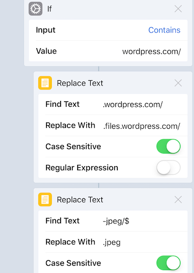

# Publish from Bear to WordPress on iOS

*Version 1.7 - 2018-01-23*

This workflow publishes notes from Bear to WordPress with images, tags, and feature image.

It works well with both WordPress.com and WordPress.org (self hosted WordPress) sites.

**Install Workflow:  [Bear note to WordPress](https://workflow.is/workflows/c9ece7c8e2e64d4599c74ed6824f54b4)**

*See also: [Bear Power Pack](https://github.com/rovest/Bear-Power-Pack/blob/master/README.md)*

## Features 
- For both WP.com and WP.org sites
- Write in Bear on Mac, iPone or iPad, publish from iOS only.
- Uploads all inline photos to WP as media and updates image links accordingly.
- An image on very first line below title, will be used as feature image.  
(To make photo a regular top image, just insert a blank line above it.)
- Prompts for excerpt to be typed, pasted or skipped. 
- Text in Bear notes enclosed in double curly brackets, like this: `{{my text as excerpt}}`, will appear as default in excerpt text input (brackets are then removed from post by workflow)
- Tags are now posted: Use tags in Bear preceded with `#wp/` like this: `#wp/Dogs` or `#wp/Goats and Horses#`.  
`#wp/` has to be in lower case!  
(`#wp/` and all other tags from bear are stripped off published text).  
Settings in Bear: `Keep tags during export` must be on for this feature to work.
- NOTE! When tags are stripped off, it could also mess up code with `#` inside code blocks! So if you are publishing code, you may need to change or remove the "cleanup" RegEx action from workflow!
- WordPress `<!--more-->` tag works even if typed wrongly as `<!—more—>` due to autocorrect (mdash — instead of --).

## How to publish to WP with this workflow
1. Select and copy a paragraph you want as excerpt.
2. Slide left on Note in note list and tap `More …` button
3. Chose `Export note …`  
4. Chose `Text Bundle`
5. Tap `Run Workflow`  
6. Tap `Bear note to WordPress` 
7. Confirm or change excerpt (from point 1.)
8. Chose `Published` or `Draft` 
9. Chose to open the published post in browser or open WP app.

## Geeky Workarounds
Had to make a few workarounds to get this to work properly:

1. Stripped textbundle extension & save to iCloud drive to “extract” package as folder.
2. Replace `%20` with `space` in image names from camera.
3. Image files are renamed with unique timestamp (to avoid name conflict and strange/buggy version numbered url returns from WP)
4. Used `Replace Text` to fix buggy media urls returned from WP (see below).

## Issues with media upload url returned from WP
There is a bug in returning urls from WorkFlow’s WP action when uploading Media, so `Replace Text` actions has to be used to fix it.   
(V. 1.3 of this workflow now also works with WordPress.org (self hosted WordPress) site.)

### WordPress.com replacement strings
Find Text: `.wordpress.com/`   
Replace with: `.files.wordpress.com/{MediaDatePath}`  

> `{MediaDatePath}` is in the format `yyyy/MM/`      
Example of replace string: `.files.wordpress.com/2018/01/`  
(`year/month/` path to media file uploads)

Find Text: `-jpeg/$`   
Replace with: `.jpeg`  
RegEx switch to `ON`



### WordPress.org replacement strings
Find Text: `(bear-image.*?)-jpeg/$`   
Replace with: `wp-content/uploads/{MediaDatePath}$1.jpeg`  
RegEx switch to `ON`


### Extra `<br />` in quotes
The `Make HTML from Rich Text` action inserts two  `<br />`  if linebreakrs are there in a quote. Replaced these to single  `<br />` , but this may have side effects for other users, so remove or change this as needed:

## Debuging
For debugging, place a `Quick Look` action after the Text action to see what’s needs to be change. And check against result in html edit mode on blog site. Tip: insert a photo in WP editor and see how the image url is supposed to be.


## Regular Expressions in workflow
Used to extract tags to WordPress and to strip off all tags from text before publish.

### Extracting WP tags
Matching `#wp/tags` while avoiding `#spaced tags#`  
```
\#wp\/([\w/-]+)[ \n]?(?!([/ \w]+\w[#]))
```

Add matches of `#wp/spaced tags#`  
```
\#wp\/([\w/ ]+?)\#[ \n]
```

### Cleaning up
Stripping all tags, including `#pesky space tags#` making sure no heading tags are stripped. If **#** is used in code blocks, it may be messed up by this.  

```
(?<![\S])\#[^#/\d \n][\S]*[ \n]?(?!([/ \w]+\w[#]))|(?<![\S])\#[^#/\d \n][\S ]*?\#[ \n]?
```

Big thanks to [Regex101](https://regex101.com/), without this tool, my head would have exploded.

#wp/bears #wp# #wp/dogs #wp/horses and cows# #wp/horses and goats# #Bear  
Oops! Not published with this workflow ;)

(*Written and edited in Bear on iOS and Mac*)

#github/bear


